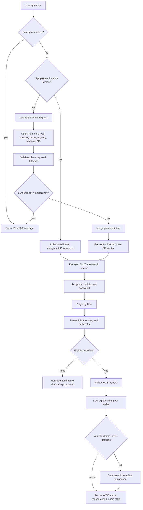

# Tempe Care Compass

Open-source care navigation using **Snowflake CoCo**, **Affine NPPES Provider Data**, **Healthparse Hospital Price Transparency**, and **Snowflake Cortex AI**.

> Provider directory only—not medical advice. Call 911 for emergencies. NPPES does not prove that care is free, low-cost, open, or accepting patients. Published hospital prices are not final costs.

## Features
- Search 6,000+ Tempe provider records by care type, ZIP, name, or specialty.
- **Price comparison**: see the same MRI or colonoscopy priced differently across hospitals.
- Demo mode with checked-in CSV snapshots; Snowflake mode with parameterized SQL.
- **Dual AI backends**: Snowflake Cortex (cloud) or Ollama/Qwen3 (local), with deterministic fallback.
- Price-aware AI guide that answers "how much does an MRI cost?" with published hospital rates.
- Separate table for independently verified sliding-fee or charity-care programs.

## Folder structure
```
tempe-care-compass/
├── app.py                  # Streamlit UI entry point — run with: streamlit run app.py
├── agent.py                # AI chatbot logic (Ollama + Cortex backends, intent parsing, grounded responses)
├── repository.py           # Data access layer (Demo CSV + Snowflake SQL for providers and prices)
├── geocoding.py            # Address-to-coordinate geocoding service (Mapbox + Nominatim + Tempe centroids)
├── style.css               # Modern high-contrast UI stylesheet
├── .env.example            # Environment variable template (copy to .env and fill in credentials)
├── data/
│   ├── tempe_nppes_demo.csv    # 280-row NPPES provider snapshot for demo mode
│   └── tempe_prices_demo.csv   # 48-row hospital pricing snapshot for demo mode
├── sql/
│   └── 01_curate_providers.sql # Full Snowflake pipeline: dynamic table, views, pricing
├── scripts/
│   └── check_data.py           # Data quality assertions on the demo CSV
├── docs/
│   ├── coco-run.md             # CoCo execution evidence (query IDs, screenshots)
│   └── demo-script.md          # 7-step, 3-minute demo outline
├── coco-prompts.md             # 4-phase CoCo runbook (Discover > Plan > Build > Review)
├── .cortex/
│   └── skills/
│       └── tempe-care-data/
│           └── SKILL.md        # CoCo project skill (6 rules for NPPES curation)
├── README.md
└── LICENSE                     # MIT
```

### File descriptions

**`app.py`** — Main Streamlit application. Renders a 3-tab layout:
1. **AI Care Guide** — chatbot that recommends the single most relevant provider and renders a pinpoint map via `st.map`
2. **Provider Directory** — search and browse provider cards with Google Maps links
3. **Price Comparison** — side-by-side hospital pricing for common procedures

Execution: `streamlit run app.py`

**`agent.py`** — AI chatbot engine with two backend classes:
- `CareAgent` — calls Ollama's local `/api/chat` endpoint (Qwen3 by default)
- `CortexAgent` — calls `SNOWFLAKE.CORTEX.COMPLETE()` via the Snowflake connector
- `_fallback_parse()` — deterministic keyword-based intent parser (no AI required)

Each agent exposes `parse()` (extract intent), `explain()` (provider recommendations), and `explain_prices()` (cost comparison). The fallback fires automatically when AI is unavailable.

**`repository.py`** — Data access layer with two repository classes:
- `DemoRepository` — reads `data/tempe_nppes_demo.csv` and `data/tempe_prices_demo.csv` using pandas
- `SnowflakeRepository` — executes parameterized SQL against `CARE_AI.CURATED.*` views and tables

Both expose identical methods: `search()`, `search_prices()`, and `get_price_comparison()`.

**`scripts/check_data.py`** — Data quality assertions on the demo CSV. Validates required columns, no null NPIs, all rows are AZ, no duplicate NPI+address pairs, and no unverified "free" claims. Execution: `python scripts/check_data.py`

**`sql/01_curate_providers.sql`** — Complete Snowflake pipeline. Creates:
- `CARE_AI.CURATED.TEMPE_PROVIDERS` dynamic table (6,183 active Tempe providers)
- `CARE_AI.CURATED.HOSPITAL_PRICES` view (normalized pricing rates)
- `CARE_AI.CURATED.PRICE_COMPARISON` view (same-procedure price spreads)
- `CARE_AI.CURATED.TEMPE_CARE_OPTIONS` view (providers + verified access programs)
- `CARE_AI.CURATED.VERIFIED_ACCESS_PROGRAMS` table (manually verified sliding-fee/charity)

## Data sources
| Dataset | Source | Coverage |
|---|---|---|
| NPPES providers | Affine NPPES Provider Data (Snowflake Marketplace) | 9.8M US providers, weekly refresh |
| Hospital prices | Healthparse Hospital Price Transparency Rates (Snowflake Marketplace) | Sample: 47 hospitals, 3 CPT codes |
| Verified programs | Manual curation (HRSA, 211) | Tempe-area only |

## Run locally (demo mode)
This project uses [uv](https://docs.astral.sh/uv/) to manage Python and dependencies.

### 1. Install uv
macOS:
```bash
curl -LsSf https://astral.sh/uv/install.sh | sh
# or: brew install uv
```
Windows (PowerShell):
```powershell
powershell -ExecutionPolicy ByPass -c "irm https://astral.sh/uv/install.ps1 | iex"
# or: winget install --id=astral-sh.uv -e
```

### 2. Create the virtual environment and install libraries
macOS:
```bash
uv venv --python 3.11
source .venv/bin/activate
uv pip install "streamlit>=1.40,<2" "pandas>=2.2,<3" "requests>=2.32,<3" \
  "snowflake-connector-python[pandas]>=3.12,<4" "pydantic>=2.9,<3" "python-dotenv>=1.0,<2"
cp .env.example .env
```
Windows (PowerShell):
```powershell
uv venv --python 3.11
.venv\Scripts\Activate.ps1
uv pip install "streamlit>=1.40,<2" "pandas>=2.2,<3" "requests>=2.32,<3" `
  "snowflake-connector-python[pandas]>=3.12,<4" "pydantic>=2.9,<3" "python-dotenv>=1.0,<2"
Copy-Item .env.example .env
```

| Library | Purpose |
|---|---|
| `streamlit` | Web UI |
| `pandas` | Demo CSV loading and data frames |
| `requests` | Ollama HTTP calls |
| `snowflake-connector-python[pandas]` | Snowflake queries and Cortex calls |
| `pydantic` | Intent/response models |
| `python-dotenv` | Loads `.env` credentials |

### 3. Run the app
```bash
uv run streamlit run app.py
```
Optional local AI:
```bash
ollama pull qwen3:8b
ollama serve
```
The deterministic fallback works when both Ollama and Cortex are unavailable.

## Snowflake setup

### 1. Get the Marketplace datasets
Open the Snowflake UI and install the following free listings from the Marketplace (click **Get** on each):

1. **Affine NPPES Provider Data** — [Marketplace listing](https://app.snowflake.com/marketplace/listing/GZT1Z2XIVUI/affine-health-intelligence-affine-nppes-provider-data)
   - Go to the link above (or search "NPPES" in the Marketplace)
   - Click **Get** to install the shared database `AFFINE_NPPES_PROVIDER_DATA` into your account
   
2. **Healthparse Hospital Price Transparency Rates** — [Marketplace listing](https://app.snowflake.com/marketplace/listing/GZT1Z4WB6KD)
   - Search "Healthparse" in the Marketplace
   - Click **Get** to install the shared database `HEALTHPARSE_HOSPITAL_PRICE_TRANSPARENCY_RATES`

### 2. Run the database setup script
Open a Snowsight worksheet (or any SQL client connected to your account) and execute the full contents of:

```
sql/01_curate_providers.sql
```

This creates the `CARE_AI` database and all required objects:
- `CARE_AI.CURATED.TEMPE_PROVIDERS` — dynamic table joining NPPES provider, address, and taxonomy data
- `CARE_AI.CURATED.HOSPITAL_PRICES` — view over Healthparse pricing data
- `CARE_AI.CURATED.PRICE_COMPARISON` — aggregated price spreads per procedure
- `CARE_AI.CURATED.TEMPE_CARE_OPTIONS` — providers joined with verified access programs
- `CARE_AI.CURATED.VERIFIED_ACCESS_PROGRAMS` — table for manually verified sliding-fee/charity programs
- `CARE_AI.CURATED.CHAT_MESSAGES` — chat history table (one message per row, JSON metadata via VARIANT column)

### 3. Install Python dependencies
Make sure the Snowflake libraries are installed in your uv environment (included in the demo setup above). To add them on their own:
```bash
uv pip install "snowflake-connector-python[pandas]>=3.12,<4" "python-dotenv>=1.0,<2"
```

### 6. Verify the connection
Works on macOS and Windows:
```bash
uv run python -c "import os, snowflake.connector as sf; from dotenv import load_dotenv; load_dotenv(); c=sf.connect(account=os.environ['SNOWFLAKE_ACCOUNT'], user=os.environ['SNOWFLAKE_USER'], password=os.environ['SNOWFLAKE_PASSWORD']); print(c.cursor().execute('select current_version()').fetchone())"
```

### 7. Run the app
```bash
uv run streamlit run app.py
```
Select **Snowflake** as data source and **Cortex** as AI backend in the sidebar.

## Snowflake objects created
| Object | Type | Description |
|---|---|---|
| `CARE_AI.CURATED.TEMPE_PROVIDERS` | Dynamic table | 6,183 active Tempe providers from NPPES |
| `CARE_AI.CURATED.HOSPITAL_PRICES` | View | Normalized hospital pricing rates |
| `CARE_AI.CURATED.PRICE_COMPARISON` | View | Same-procedure price spread across hospitals |
| `CARE_AI.CURATED.TEMPE_CARE_OPTIONS` | View | Providers joined with verified access programs |
| `CARE_AI.CURATED.VERIFIED_ACCESS_PROGRAMS` | Table | Manually verified sliding-fee/charity programs |
| `CARE_AI.CURATED.CHAT_MESSAGES` | Table | Chat history — one message per row with JSON metadata |

## Important design choices
- **NPPES cannot establish affordability.** The app never labels a provider as free without verification from `VERIFIED_ACCESS_PROGRAMS`.
- **Hospital pricing is a sample.** The Healthparse listing covers ~47 California hospitals and 3 CPT codes. Full national coverage requires the paid listing.
- **Cortex AI is optional.** The app works without any AI backend using deterministic keyword matching and fallback responses.

## AI search (RAG system)

### Problem statement
> The AI search: if they say an address or location, or words like fever, symptoms, broke arm, sick or another condition, the LLM should read the whole request, then do a custom RAG search and provide the location.

### How we solved it
- **Detect the request type.** `rag/understand.py` checks for symptom/condition words (fever, sick, broke, sprain, rash, body parts) and location words (address, near, street, ASU, "I'm at").
- **Safety first.** A deterministic emergency check runs before any LLM call. Chest pain, trouble breathing, overdose or self-harm return a 911/988 message immediately.
- **LLM reads the whole request.** Cortex (Messages API) or Ollama returns a structured `QueryPlan`: care type, category, ordered NPPES specialty terms, urgency, address/landmark text, ZIP and a one-line reason. It translates the request; it never diagnoses or picks providers.
- **Code validates the plan.** Category must be from the allowed list, terms are sanitized (max 8), the ZIP must match a real format. A keyword fallback produces the same plan when no LLM is available.
- **Custom RAG search.** The plan's specialty terms drive retrieval over all 6,183 providers: BM25 keyword search plus a semantic (synonym + trigram) search, fused with reciprocal rank fusion into a pool of 40.
- **Eligibility filter.** Removes invalid, inactive, out-of-area, wrong-category and duplicate records. Symptom requests exclude dental, pharmacy and behavioral health unless asked for.
- **Location.** The address is geocoded with `geocoding.py`; distances are measured from that point to each provider's ZIP center (Census ZCTA). Without an address, the requested ZIP or Tempe is used, and the app says which.
- **Deterministic ranking.** Each provider gets 0-100 scores for service match (35%), proximity (30%), price/affordability (20%), data confidence (10%) and verified availability (5%). Unknown data is never scored as negative.
- **Exactly three results.** Code labels the top results A, B and C. It never pads; if fewer qualify, it says why.
- **LLM explains, never ranks.** The model receives only those three records with their scores and source IDs and writes why A is first, why A beats B, and so on.
- **Validation.** The explanation is rejected if it reorders providers, cites unknown sources, or claims something unverified (free, walk-in, accepting patients, invented distances, quality claims). A deterministic template is used instead.
- **UI.** The AI Care Guide shows what the system looked for, where it searched, the A/B/C cards with reasons, a map for A and the score table.

### Process flow


### Key files
| File | Role |
|---|---|
| `rag/understand.py` | Trigger detection, LLM `QueryPlan`, keyword fallback, merge into intent |
| `rag/intent.py` | Rule-based intent and emergency detection |
| `rag/retrieve.py` | BM25 + semantic retrieval, reciprocal rank fusion |
| `rag/filter.py` | Eligibility filtering with elimination counts |
| `rag/rank.py`, `rag/config.py` | Scoring, weights, tie-breaks |
| `rag/geo.py`, `data/az_zip_centroids.csv` | ZIP centroids and distance |
| `rag/prices.py` | Comparable price matching (local hospitals only) |
| `rag/explain.py`, `llm/cortex_messages.py` | Prepared records, Cortex Messages structured output, template |
| `rag/validate.py` | Order, citation and claim checks |
| `rag/service.py` | `ProviderRecommendationService.recommend()` pipeline used by `app.py` |

## Tests
```bash
uv run python scripts/check_data.py
uv run python -m py_compile app.py agent.py repository.py
uv run python -m unittest discover -s tests -t . -v
```

## Sources
- Affine NPPES: Snowflake Marketplace listing `GZT1Z2XIVUI`
- Healthparse HPT: Snowflake Marketplace listing `GZT1Z4WB6KD` (NOTE: this dataset only labels the market price across California , no clinic options avaliable across Tempe )
- NPPES API: https://npiregistry.cms.hhs.gov/api-page
- HRSA health centers: https://data.hrsa.gov/topics/health-centers
- Hospital prices: https://www.cms.gov/priorities/key-initiatives/hospital-price-transparency
